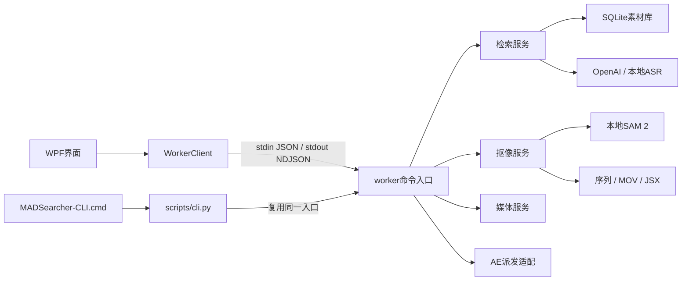

# MADSearcher 扩展开发说明

版本：1.0.0；更新日期：2026-09-11。工作分支为 `dev`。继续开发前阅读[技术方案](技术方案.md)、[设计文档](设计文档.md)、[任务 DAG](tasks.json)及根目录 `AGENTS.md`。用户的原始需求文档应保留，功能边界变更写入设计文档。

当前已完成实现、发布和使用文档；新增及回归测试按用户要求延期。本说明记录现有结构与扩展约束，不代表最新版本通过全面验收。

## 1. 目录和职责

| 路径 | 职责 |
| --- | --- |
| `src/MADSearcher.Desktop/MainWindow.xaml` | WPF页面、布局、控件与绑定 |
| `MainWindow.xaml.cs` | 窗口生命周期、导航、共用输入与运行状态处理 |
| `MainWindow.Search.cs` | 素材库、索引、检索、预览和片段导出交互 |
| `MainWindow.Cutout.cs` | 抠像表单、首帧提示、输出展示与桌面端AE交接 |
| `MainWindow.Settings.cs` | 普通设置、环境检查与配置输入 |
| `Models.cs` | 设置映射、界面状态、数据展示模型 |
| `WorkerClient.cs` / `ProcessJob.cs` | UTF-8进程通信、错误脱敏、取消及子进程树生命周期 |
| `scripts/cli.py` | 参数化命令行及JSON请求适配，不实现业务算法 |
| `worker/mad_worker/__main__.py` | 请求解析、命令分发、统一结果与错误事件 |
| `context.py` / `validation.py` / `errors.py` | 请求上下文、输入校验与业务异常 |
| `media.py` | FFmpeg / FFprobe参数数组调用、媒体探测、取帧与转码 |
| `timecode.py` | 非丢帧时间码、秒数与源帧号转换、半开范围及帧数校验 |
| `store.py` | SQLite结构、分组/素材记录及索引事务 |
| `subtitles.py` | 字幕解码、时间轴解析与偏移 |
| `ai.py` | OpenAI图像理解、结构化定位与向量请求 |
| `search.py` | 素材库业务、ASR适配、索引检查点与组内混合检索 |
| `cutout.py` | 提示验证、SAM模型加载、分块传播与抠像任务组织 |
| `exporters.py` | PNG / MOV / AE路径等输出处理 |
| `adobe.py` | CLI的 `ae.send` 路径校验与外部进程派发 |
| `scripts/setup.ps1` / `start.ps1` / `publish.ps1` | 环境准备、编译启动、发布 |
| `scripts/dag.py` | DAG依赖校验及状态更新 |
| `tests/` / `Smoke.cs` | 已有测试代码，当前不自动运行 |
| `.agents/skills/madsearcher-runtime/SKILL.md` | 本项目已复现的安装、内存和编码问题处理经验 |

表中未带目录的C#文件位于 `src/MADSearcher.Desktop/`，Python模块位于 `worker/mad_worker/`。当前采用模块与显式命令分发，尚无动态插件注册或数据库迁移框架。扩展应先沿现有边界增加模块，确有需要时再引入公共抽象。

## 2. 调用链与进程合同



桌面端为一次操作启动一个Python worker，不监听HTTP端口。CLI在当前Python进程中复用worker入口，保持相同业务处理与错误格式。完整命令表在[设计文档](设计文档.md)，命令行例子在[使用说明](使用说明.md)。

原始调用方式为：在 `worker/` 下运行 `python -u -m mad_worker`，向stdin写入一个JSON对象并关闭输入。例如：

```json
{"command":"group.list","params":{},"settings":{},"workspace":"E:/MADSearcher/MADSearcherTool/workspace"}
```

stdout为逐行事件流，不能直接打印调试信息：

```json
{"type":"progress","progress":0.5,"message":"正在处理…"}
{"type":"result","data":{"groups":[]}}
```

失败返回 `{"type":"error","code":"validation","message":"具体修复说明"}`。worker成功退出0，失败退出1；CLI还使用2表示参数语法错误、130表示Ctrl+C。帮助及参数语法提示由argparse输出，调用方不能把 `--help` 的输出当作业务NDJSON解析。依赖库普通输出重定向到stderr，桌面客户端持续读取stderr避免管道堵塞。

模块入口遵循 `handle(command, params, ctx) -> dict`。`Context`持有解析后的工作区、设置、`Media`和进度回调；`UserError(message, code="validation")`用于可预期失败。用户输入在worker中完成最终校验，界面校验只用于提前提示。不要仅在WPF中限制输入，使CLI能够绕过同一约束。

桌面客户端通过Windows Job对象拥有worker及其子进程，取消与退出时清理整个树。运行期只禁新增任务入口及分组/工作区切换，保留浏览、播放、输入和保存设置。`AppSettings.Snapshot()`固定整次任务的设置，批量处理也必须在第一次await前捕获所有选项；预览/首帧使用输入版本号拒绝过期UI更新。不得用整页IsEnabled绑定代替任务入口限制，也不引入任务队列。AE是用户继续创作的外部应用，不能归入这个短命worker的Job：GUI直接派发，CLI使用独立的 `adobe.py` 适配。两者的“已派发”均不代表AE执行成功，也不自动保存用户工程。

## 3. 数据、缓存与设置

默认工作区为项目的 `workspace/`，SQLite数据库为 `library.sqlite3`。分组、视频和片段通过外键关联，删除库记录级联清理索引，不删除源视频。素材按规范化路径在同组内去重。

`Store.replace_index`在耗时的字幕、模型和缩略图处理完成后，使用单一事务替换该视频的全部片段。失败或取消时不能提交半份索引。视频大小和修改时间、字幕指纹、角色说明及索引配置用于检查数据是否仍适用；索引检查点在配置相同时可复用。扩展采样、模型输入或索引格式时同步调整配置版本和缓存键，避免新逻辑复用不兼容的旧结果。

当前数据库初始化采用 `CREATE TABLE IF NOT EXISTS`。未来新增必需列、改变字段含义或调整关联关系时，需要显式版本迁移与备份方案；仅改初始化SQL不会升级用户已有数据库。检索必须保留 `group_id` 过滤；向量使用对应模型名称校验，不能混用不同模型生成的向量。

普通桌面设置固定保存在项目的 `workspace/settings.json`；其中的 `Workspace` 字段可选择另一个项目内工作区。CLI默认读取这份设置，也支持独立设置与 `--workspace` 覆盖。相对路径在CLI中按调用者当前目录解析，脚本集成宜传绝对路径。

按用户最新要求，API key随WPF设置明文序列化到被Git忽略的 `workspace/settings.json`，启动时恢复到密码框。CLI读取文件中的 `ApiKey` / `api_key`，显式存在的环境变量可覆盖（包括空值）；原始request则使用请求settings或环境变量。不能新增会将密钥暴露到进程列表的命令参数。日志、进度、异常和manifest均不应包含密钥。索引只有显式开启 `visual` 或 `semantic` 才能创建API客户端，填写密钥本身不构成发送素材的指令。

运行时目录 `.venv/`、`models/`、`workspace/`、`artifacts/` 均在Git忽略列表中。原视频和字幕保持只读；生成文件使用内部缓存名或独立任务目录。预览文件在完成后替换最终路径；抠像只有全部必需产物完成后才写manifest并清理未完成标记。

## 4. 增加或修改功能

1. 在技术方案和设计文档中明确输入、输出、依赖与失败边界；在DAG中新增节点，复杂任务可继续细分子DAG。依赖未完成时不得启动节点。
2. 将算法或业务逻辑放入对应worker模块；新领域增加独立模块。共用媒体调用、校验和数据访问层，不在CLI或按钮处理器中重复实现。
3. 在 `__main__.py` 路由命令，使用JSON可序列化的字典返回结果，以 `ctx.progress` 报告进度。FFmpeg和外部程序使用参数数组，避免shell拼接。
4. 在 `scripts/cli.py` 的 `COMMANDS` 声明字段；按类型更新 `FLOATS`、`FLAGS` 或选项声明。`--params-file` 与原始请求仍须走同一worker校验。
5. 如有新设置，同步修改 `AppSettings`、`WorkerValues()`、CLI的 `SETTINGS` 映射和设置界面。明确默认值、持久化规则、模型兼容性及是否影响缓存。
6. WPF通过 `WorkerClient` 调用业务服务，保留忙碌状态、取消和错误恢复；更换来源、分组或得到空结果时清理旧预览及派生状态。
7. 更新协议表、使用说明、功能边界和交付记录。测试执行按用户后续文档安排，不能把编译通过记为功能验收通过。

抠像新增模型应保留完整画布、帧序、空前景处理与可修补的像素序列。范围解析统一经过 `timecode.resolve_range`；WPF调用 `cutout.range` 获取 `CutRangeInfo`，随后首帧传 `frame_index`、抠像传 `start_frame/end_frame`，不在C#或CLI重写时间码算法。解析后的时间码回填只能应用于未变更的表单，并更新自身版本号。FFmpeg按源解码帧序trim、终点不含，不能用秒数seek或fps滤镜替换，否则预览与实际首帧会偏移。manifest版本2明确源帧号，秒数是帧号除以平均帧率；VFR输出保留帧序但改为CFR时序。

更换模型或改变分块方式时重新说明内存需求、时间映射和跟踪边界。新增导出器应保留明确的完成/失败标记；可选导出失败通过warnings解释，不伪造文件路径。AE轮廓与PNG alpha的差异见[抠像边界](抠像边界.md)。

## 5. 编译、发布和进度维护

在仓库根目录执行以下构建命令；它们不运行功能测试：

```powershell
dotnet build .\src\MADSearcher.Desktop\MADSearcher.Desktop.csproj -c Release
powershell -NoProfile -ExecutionPolicy Bypass -File .\scripts\publish.ps1
```

项目程序集名为 `MADSearcher`，发布程序为 `artifacts/app/MADSearcher.exe`。发布采用依赖框架模式，需要.NET 9 Desktop Runtime。它通过上级目录定位项目中的worker和运行时，因此应保留整个仓库布局，不能将单个EXE作为独立安装包发放。桌面启动脚本需要SDK；CLI只依赖Python及所调用功能需要的组件。

DAG无参数调用仅核对结构与依赖；状态更新使用：

```powershell
.\.venv\Scripts\python.exe scripts\dag.py
.\.venv\Scripts\python.exe scripts\dag.py --task 节点ID --status in_progress
.\.venv\Scripts\python.exe scripts\dag.py --task 节点ID --status completed --evidence '实际完成的工作与证据'
```

直接子任务可以加 `--subtask 子节点ID`。状态支持 `pending`、`in_progress`、`completed`、`deferred`；有子DAG的父节点只有全部子项完成才能标记完成。更深层子DAG结构可递归校验，现有命令行更新器仅提供一层 `--subtask` 定位。

已有测试位于 `tests/test_foundation.py`、`test_subtitles.py`、`test_ai.py`、`test_search.py`、`test_cutout.py`；新增 `test_timecode.py` 记录单帧、非整数帧率、末帧及非法范围合同，尚未运行。真实模型与AE脚本分别在 `smoke_sam.py`、`smoke_ae.py`，桌面检查入口在 `Smoke.cs`。当前 `acceptance` 为延期状态，不自动执行这些入口。后续验收优先使用公共CLI，无法覆盖的界面体验留给人工检查，AE可按用户要求继续暂缓。
