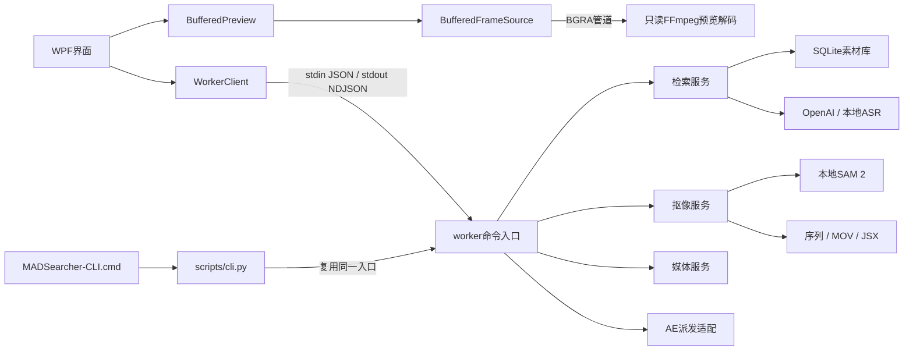

# MADSearcher 扩展开发说明

版本：v0.1.0后的dev开发；更新日期：2026-09-12。工作分支为 `dev`。继续开发前阅读[技术方案](技术方案.md)、[设计文档](设计文档.md)、[任务 DAG](tasks.json)及根目录 `AGENTS.md`。用户的原始需求文档应保留，功能边界变更写入设计文档。

当前已完成实现、发布和使用文档；新增及回归测试按用户要求延期。本说明记录现有结构与扩展约束，不代表最新版本通过全面验收。

## 1. 目录和职责

| 路径 | 职责 |
| --- | --- |
| `src/MADSearcher.Desktop/MainWindow.xaml` | WPF页面、布局、控件与绑定 |
| `MainWindow.xaml.cs` | 窗口生命周期、导航、共用输入与运行状态处理 |
| `MainWindow.Search.cs` | 素材库、索引、检索、预览和片段导出交互 |
| `MainWindow.Cutout.cs` | 抠像表单、双预览接入、范围同步、输出展示与桌面端AE交接 |
| `BufferedFrameSource.cs` | 只读FFmpeg持续解码、滑动预取、有界帧缓存、背压与独立取消 |
| `BufferedPreview.xaml` / `.xaml.cs` | 播放时钟、等待/错误状态、逐帧显示、快捷键及选区事件 |
| `FrameTimeline.cs` | 整数帧时间线、缓存/选区绘制、指针拖动及缩放 |
| `MainWindow.Settings.cs` | 普通设置、环境检查与配置输入 |
| `GroupEditorWindow.xaml` / `.xaml.cs` | 可空角色卡片、草稿隔离、参考图预览与保存 |
| `Models.cs` | 设置映射、界面状态、数据展示模型 |
| `WorkerClient.cs` / `ProcessJob.cs` | UTF-8进程通信、错误脱敏、取消及子进程树生命周期 |
| `scripts/cli.py` | 参数化命令行及JSON请求适配，不实现业务算法 |
| `worker/mad_worker/__main__.py` | 请求解析、命令分发、统一结果与错误事件 |
| `context.py` / `validation.py` / `errors.py` | 请求上下文、输入校验与业务异常 |
| `media.py` | FFmpeg / FFprobe参数数组调用、媒体探测、取帧与转码 |
| `timecode.py` | 非丢帧时间码、秒数与源帧号转换、半开范围及帧数校验 |
| `store.py` | SQLite结构、分组/素材记录及索引事务 |
| `subtitles.py` | 字幕解码、时间轴解析与偏移 |
| `characters.py` | 角色字段校验、稳定ID、参考原图托管及资料指纹 |
| `images.py` | 不可变图像策略：索引512/抠像原尺寸，EXIF校正及按条数/字节限制的LRU编码缓存 |
| `prompts.py` | 角色关联固定提示词与版本 |
| `profiling.py` | 索引JSONL、包含/自身耗时、缓存计数和API usage |
| `ai.py` | OpenAI图像理解、结构化定位与向量请求 |
| `search.py` | 素材库业务、ASR适配、索引检查点与组内混合检索 |
| `cutout.py` | 提示验证、SAM模型加载、分块传播与抠像任务组织 |
| `exporters.py` | PNG / MOV / AE路径等输出处理 |
| `adobe.py` | CLI的 `ae.send` 路径校验与外部进程派发 |
| `scripts/setup.ps1` / `start.ps1` / `publish.ps1` | 环境准备、编译启动、发布 |
| `scripts/dag.py` | DAG依赖校验及状态更新 |
| `tests/` / `Smoke.cs` | 已有测试代码，当前不自动运行 |
| `.agents/skills/madsearcher-runtime/SKILL.md` | 本项目已复现的安装、内存和编码问题处理经验 |

表中未带目录的C#文件位于 `src/MADSearcher.Desktop/`，Python模块位于 `worker/mad_worker/`。当前采用模块与显式命令分发，尚无动态插件注册；数据库已有显式user_version迁移，未引入第三方迁移框架。扩展应先沿现有边界增加模块，确有需要时再引入公共抽象。

## 2. 调用链与进程合同



桌面端为一次操作启动一个Python worker，不监听HTTP端口。CLI在当前Python进程中复用worker入口，保持相同业务处理与错误格式。完整命令表在[设计文档](设计文档.md)，命令行例子在[使用说明](使用说明.md)。

原始调用方式为：在 `worker/` 下运行 `python -u -m mad_worker`，向stdin写入一个JSON对象并关闭输入。例如：

```json
{"command":"group.list","params":{},"settings":{},"workspace":"E:/MADSearcher/MADSearcherTool/workspace"}
```

stdout为逐行事件流，不能直接打印调试信息：

```json
{"type":"progress","progress":0.5,"message":"正在处理…"}
{"type":"result","data":{"groups":[]}}
```

失败返回 `{"type":"error","code":"validation","message":"具体修复说明"}`。worker成功退出0，失败退出1；CLI还使用2表示参数语法错误、130表示Ctrl+C。帮助及参数语法提示由argparse输出，调用方不能把 `--help` 的输出当作业务NDJSON解析。依赖库普通输出重定向到stderr，桌面客户端持续读取stderr避免管道堵塞。

模块入口遵循 `handle(command, params, ctx) -> dict`。`Context`持有解析后的工作区、设置、`Media`和进度回调；`UserError(message, code="validation")`用于可预期失败。用户输入在worker中完成最终校验，界面校验只用于提前提示。不要仅在WPF中限制输入，使CLI能够绕过同一约束。

桌面客户端通过Windows Job对象拥有worker及其子进程，取消与退出时清理整个树。运行期只禁新增任务入口及分组/工作区切换，保留浏览、播放、输入和保存设置。`AppSettings.Snapshot()`固定整次任务的设置，批量处理也必须在第一次await前捕获所有选项；预览/首帧使用输入版本号拒绝过期UI更新。不得用整页IsEnabled绑定代替任务入口限制，也不引入任务队列。AE是用户继续创作的外部应用，不能归入这个短命worker的Job：GUI直接派发，CLI使用独立的 `adobe.py` 适配。两者的“已派发”均不代表AE执行成功，也不自动保存用户工程。

## 3. 数据、缓存与设置

默认工作区为项目的 `workspace/`，SQLite数据库为 `library.sqlite3`。分组、视频和片段通过外键关联，删除库记录级联清理索引，不删除源视频。素材按规范化路径在同组内去重。

`Store.replace_index`在耗时的字幕、模型和缩略图处理完成后，使用单一事务替换该视频的全部片段。失败或取消时不能提交半份索引。视频大小和修改时间、字幕指纹、角色说明及索引配置用于检查数据是否仍适用；索引检查点在配置相同时可复用。扩展采样、模型输入或索引格式时同步调整配置版本和缓存键，避免新逻辑复用不兼容的旧结果。

数据库已增加 `characters` 和 `segment_characters`，由 `PRAGMA user_version=2` 管理：旧库先通过SQLite backup写入工作区backups，再在事务中创建新增表。高版本库拒绝打开。未来修改表或字段要递增版本并提供迁移，不能仅更改初始化SQL。角色ID校验归属，删除角色级联移除关联；完整索引在写锁内再次核对背景和角色快照，避免并发更新提交过期身份。检索必须保留 `group_id` 过滤；向量使用对应模型名称校验，不能混用不同模型生成的向量。

普通桌面设置固定保存在项目的 `workspace/settings.json`；其中的 `Workspace` 字段可选择另一个项目内工作区。CLI默认读取这份设置，也支持独立设置与 `--workspace` 覆盖。相对路径在CLI中按调用者当前目录解析，脚本集成宜传绝对路径。

按用户最新要求，API key随WPF设置明文序列化到被Git忽略的 `workspace/settings.json`，启动时恢复到密码框。CLI读取文件中的 `ApiKey` / `api_key`，显式存在的环境变量可覆盖（包括空值）；原始request则使用请求settings或环境变量。不能新增会将密钥暴露到进程列表的命令参数。日志、进度、异常和manifest均不应包含密钥。索引只有显式开启 `visual` 或 `semantic` 才能创建API客户端，填写密钥本身不构成发送素材的指令。

运行时目录 `.venv/`、`models/`、`workspace/`、`artifacts/` 均在Git忽略列表中。原视频和字幕保持只读；生成文件使用内部缓存名或独立任务目录。预览文件在完成后替换最终路径；抠像只有全部必需产物完成后才写manifest并清理未完成标记。

角色参考原图在 `workspace/characters/references`，索引上传时才生成512像素JPEG内存副本，不改本地SAM尺寸。角色快照与引用图片元数据参与视觉缓存指纹，当前索引配置版本4；采样方式/提示词/图像策略变动都应同步失效检查点。旧客户端更新分组时不传characters则保留原角色，传数组则完整替换，空数组清空。

索引用 `ctx.measure(stage, **metadata)` 添加阶段；它委托当前 `IndexProfile`，非索引上下文为空操作。计时嵌套使用单线程栈，后续若增加并行索引，应为每个任务隔离profile或改用contextvars，不能跨线程共享同一栈。`api_usage`只汇总API真实返回的数字，不估算token、金额或缓存优惠。禁止把角色正文、字幕、base64或完整异常对象传入日志metadata。完整流程与提示词见[角色索引技术路线与提示词](角色索引技术路线与提示词.md)。

## 4. 增加或修改功能

1. 在技术方案和设计文档中明确输入、输出、依赖与失败边界；在DAG中新增节点，复杂任务可继续细分子DAG。依赖未完成时不得启动节点。
2. 将算法或业务逻辑放入对应worker模块；新领域增加独立模块。共用媒体调用、校验和数据访问层，不在CLI或按钮处理器中重复实现。
3. 在 `__main__.py` 路由命令，使用JSON可序列化的字典返回结果，以 `ctx.progress` 报告进度。FFmpeg和外部程序使用参数数组，避免shell拼接。
4. 在 `scripts/cli.py` 的 `COMMANDS` 声明字段；按类型更新 `FLOATS`、`FLAGS` 或选项声明。`--params-file` 与原始请求仍须走同一worker校验。
5. 如有新设置，同步修改 `AppSettings`、`WorkerValues()`、CLI的 `SETTINGS` 映射和设置界面。明确默认值、持久化规则、模型兼容性及是否影响缓存。
6. WPF通过 `WorkerClient` 调用业务服务，保留忙碌状态、取消和错误恢复；更换来源、分组或得到空结果时清理旧预览及派生状态。
7. 更新协议表、使用说明、功能边界和交付记录。测试执行按用户后续文档安排，不能把编译通过记为功能验收通过。

抠像新增模型应保留完整画布、帧序、空前景处理与可修补的像素序列。范围解析统一经过 `timecode.resolve_range`；WPF调用 `cutout.range` 获取 `CutRangeInfo`，随后抠像传 `start_frame/end_frame`。交互式预览用相同源帧序trim；C#仅用worker提供的nominal_fps格式化整数帧号，字符串解析及业务范围校验仍统一在worker。解析后的时间码回填只能应用于未变更的表单，并更新自身版本号。FFmpeg按源解码帧序trim、终点不含，不能用秒数seek或fps滤镜替换，否则预览与实际首帧会偏移。manifest版本2明确源帧号，秒数是帧号除以平均帧率；VFR输出保留帧序但改为CFR时序。

更换模型或改变分块方式时重新说明内存需求、时间映射和跟踪边界。新增导出器应保留明确的完成/失败标记；可选导出失败通过warnings解释，不伪造文件路径。AE轮廓与PNG alpha的差异见[抠像边界](抠像边界.md)。

## 5. 编译、发布和进度维护

在仓库根目录执行以下构建命令；它们不运行功能测试：

```powershell
dotnet build .\src\MADSearcher.Desktop\MADSearcher.Desktop.csproj -c Release
powershell -NoProfile -ExecutionPolicy Bypass -File .\scripts\publish.ps1
```

项目程序集名为 `MADSearcher`，发布程序为 `artifacts/app/MADSearcher.exe`。发布采用依赖框架模式，需要.NET 9 Desktop Runtime。它通过上级目录定位项目中的worker和运行时，因此应保留整个仓库布局，不能将单个EXE作为独立安装包发放。桌面启动脚本需要SDK；CLI只依赖Python及所调用功能需要的组件。

DAG无参数调用仅核对结构与依赖；状态更新使用：

```powershell
.\.venv\Scripts\python.exe scripts\dag.py
.\.venv\Scripts\python.exe scripts\dag.py --task 节点ID --status in_progress
.\.venv\Scripts\python.exe scripts\dag.py --task 节点ID --status completed --evidence '实际完成的工作与证据'
```

直接子任务可以加 `--subtask 子节点ID`。状态支持 `pending`、`in_progress`、`completed`、`deferred`；有子DAG的父节点只有全部子项完成才能标记完成。更深层子DAG结构可递归校验，现有命令行更新器仅提供一层 `--subtask` 定位。

已有测试位于 `tests/test_foundation.py`、`test_subtitles.py`、`test_ai.py`、`test_search.py`、`test_cutout.py`；新增 `test_timecode.py` 记录单帧、非整数帧率、末帧及非法范围合同，尚未运行。真实模型与AE脚本分别在 `smoke_sam.py`、`smoke_ae.py`，桌面检查入口在 `Smoke.cs`。当前 `acceptance` 为延期状态，不自动执行这些入口。后续验收优先使用公共CLI，无法覆盖的界面体验留给人工检查，AE可按用户要求继续暂缓。

`v0.1.0`已固定到35edf258645c9f6cd091a261e60c59639b929cae，后续任何修复或功能都不得移动该标签。测试执行继续等待用户安排，编译发布不等于功能通过。

视觉诊断使用 `IndexProfile.validation_failure(**metadata)`：继承当前span的片段上下文、写入JSONL并保留在summary.validation_failure。`OpenAIClient._validate_clip_result`集中检查原有约束、收集有界的原因与字段摘要；`_diagnostic_scalar`先脱敏再限长，禁止直接转储模型响应或依据正文。日志版本单独更新，不因为纯诊断变化而递增提示词/索引版本，避免使可用检查点失效。

## 预览模块扩展约束（反馈7）

PreviewMedia固定源路径、尺寸、平均帧率、标称帧率、总帧数和结果源偏移。BufferedFrameSource以锁保护缓存/请求状态，单个后台pump拥有解码进程；Request更新目标位置，Suspend保留缓存并取消解码，Dispose释放会话。普通视频从头按源帧序trim，结果通过image2的start_number直接读取RGBA序列；rawvideo BGRA采用固定宽高逐帧读满后入缓存。stdout是像素管道而不是worker NDJSON，stderr持续排空且不保留。取消通过Windows Job/进程树清理，下一解码必须等旧进程退出；UI线程不等待解码退出。

背压按当前位置加约5秒控制读管道，缓存保留已走过的约2秒，像素预算每源128MiB，尺寸按640长边和约8秒容量缩放。预算只指缓存像素，应用总内存还包括WPF位图、解码器和其他模块。快速seek由UI合并120ms；缓存命中立即显示，新位置超出解码覆盖范围时取消旧解码。独立预览不设置全局Busy，不写任务状态，不调用AI；鼠标焦点/播放激活一个面板时暂停另一个面板。原素材必须只读。

时间线及工作区统一半开帧范围，界面O按钮产生当前帧+1；仅已显示的当前帧可作边界。起止输入修改后用300ms合并的独立cutout.range请求回填选区，带取消和选择版本检查，不能应用过期结果。提交任务仍经过原有ResolveCutSelection及设置/输入快照。未来增加快速关键帧定位、持久磁盘缓存或音频时需保持源帧号映射，不得仅把秒数seek的近似位置当作精确帧号。

图像策略通过OpenAIClient(image_policy=...)显式传递，默认INDEX_IMAGE_POLICY，仅抠像locate_target选择CUTOUT_IMAGE_POLICY。新增用途必须明确指定策略，不能修改默认策略而使已有索引检查点悄悄失效。尺寸、JPEG质量、输入/编码字节数及detail均来自不可变策略；缓存键包含策略，数据URL总量64MiB与128项限制共同生效。抠像原尺寸策略不调用thumbnail；异常体积直接报错，不降采样兜底。完整合同见设计文档第14节。


## 镜头分段扩展（反馈11）

frame_stream.py只负责有界、可关闭的FFmpeg像素/PTS流；segmentation.py负责检测、时间分段、采样选择和文件缓存；search.py负责字幕、AI缓存和事务索引。修改检测/采样规则须递增DETECTOR_VERSION/SAMPLING_VERSION，修改视觉提示词须递增PROMPT_VERSION。frame_indices是当前请求内的采样序号，不是源帧号；源帧号和采样时间保存在片段metadata，合并结果的各角色证据携带自身sample_times。

数据库版本2加入shots表与segments.shot_id/metadata。前后镜头范围独立查询，不能把完整镜头列表加入每行index_config造成二次方内存增长。非镜头索引的shot_id为空，保留历史合并行为。分析缓存按源区间/采样/字幕/角色和模型参数寻址，变更全局长镜头上限不应使未变化片段重新付费。详情见[镜头分段与动态采样](镜头分段与动态采样.md)。

## 查询与排序扩展（反馈13）

retrieval.py是无I/O的查询规划、候选证据与排名模块；query_vectors.py集中处理查询向量缓存及批量请求；search.py协调索引有效性、模型兼容、数据读取和结果合并。改动查询策略递增STRATEGY_VERSION，不递增索引/视觉提示词版本。QueryPlan保留原句、姓名位置、候选角色组和变体；有歧义的姓名不能任意选一个ID，也不能用其某一候选的外观替换。

search.run返回query_analysis，包含strategy、mode、characters、variants、semantic_variants及可选vector_cache；semantic_variants只列成功获得查询向量的通道，单个片段仍可能因没有兼容索引向量而仅参与文字匹配。每个结果的ranking_details记录文字/向量分、route、event_strength、rrf、role_direct、role_support及base_score；ranking_summary供界面解释。合并片段必须继承最高分子段的解释，不能把合并后的角色并集包装成该子段的真实同框证据。

缓存以版本、模型和查询文本的SHA256寻址，内容只含模型、摘要key与归一化向量；读取时校验模型、key、有限非零向量和当前索引维度。损坏/错误维度重新获取，API异常沿用关键词降级，缓存写入失败不丢弃业务结果。缓存容量256项/64MiB，处于被忽略的workspace目录。后续新增embedding维度设置或索引模型身份字段时需同步纳入兼容判定和缓存键。

新增待执行回归源代码tests/test_retrieval.py覆盖句内姓名、英文/单字边界、同名歧义、外观预算、情节与人物权重、补充召回门槛单调性、RRF并列名次、邻近证据及缓存恢复；test_search.py维护模型去空格与重复查询缓存合同。只维护源码，未运行这些测试。详细分数定义及边界见[姓名查询与排序](姓名查询与排序.md)。

## 独立台词扩展

dialogue.py负责字幕单元规划、来源有效性、向量复用及无媒体处理的补建；dialogue_search.py负责字幕文字/语义候选、时段去重与结果融合；search.py协调两个检索通道、模型兼容和共享查询向量。subtitle_cues保存条目及lane，subtitle_units保存single/context及cue_ids、向量，subtitle_indexes保存独立来源指纹/偏移/条数。Store版本3升级前backup，只新增字幕表；完整索引事务同时保存字幕，index.dialogue事务只替换字幕表。

Cue新增可选lane/lines，保持旧text字段清理结果不变，避免仅保存换行信息就使已有视觉检查点失效。lane结合ASS样式与文字类别，属于保守启发式，不能当成语言或说话人真值。修改单元规划须递增dialogue.VERSION；修改排序须递增dialogue_search.STRATEGY；纯字幕调整不递增视觉PROMPT_VERSION或索引图片策略。后台stdout仍仅NDJSON。

index.dialogue参数为video_id、可选subtitle_path/subtitle_offset、semantic（worker默认true，界面由复选框显式传入）。返回subtitle_index配置和日志路径；不调用media.probe、FFmpeg、视觉或ASR。search.run的mode支持combined/dialogue/scene，默认combined。query_analysis.search_mode、subtitle_unit_count说明实际模式与有效单元数；每个台词结果含dialogue_matches，记录原文、原时间、kind、approximate及文字/语义/融合分，不能从台词姓名推导character_matches。显式character_id在召回截断前按有效片段的出镜关联过滤。

query_vectors.cached_embeddings通过purpose选择query（256项/64MiB）或dialogue（16384项/256MiB）缓存。补建先复用数据库中兼容文本向量，即使文件缓存已被淘汰也不重复计算；仅缺失文本分批请求。模型名及维度校验、缓存故障不覆盖成功结果的规则适用于两种用途。所有费用和日志取实际执行数据，不把字面覆盖率当作语义相似度。

tests/test_dialogue.py维护待执行单元规划、双语换行、低字面高语义候选、原文优先、补建无媒体调用、背景变更独立有效性、数据库向量复用、失败保留、共享查询向量和版本2迁移备份合同。旧test_search.py显式选scene保留原片段范围回归，默认综合/台词模式在新文件覆盖。本次没有执行任何功能测试。完整规则见[台词检索与补建](台词检索与补建.md)。

## ASS可见文本清理

subtitles.py在同一个事件内按标签顺序跟踪绘图状态，先取完整可见文本再处理换行，避免在每行重新初始化状态。`_AssEvent`仅为解析内部元数据，保留原样式和Name/Actor用于去重边界；对外仍返回Cue和warnings，兼容现有调用。`parse_subtitles(..., diagnostics=字典)`可取得纯计数诊断，调用方在 `subtitles.parse` 阶段内用 `subtitles.cleanup` 事件记录；不要把字幕、原始ASS行或路径写进这组统计。

重复层先按完整样式/说话人/可见文本/换行和时间去重，再分别合并fx与未标记的短显示事件，最后去重合并后的完整底层。阈值集中为0.12秒单事件、0.05秒间隔，未标记事件至少3条；偏移和裁剪放在合并之后，普通零时长事件不进入短帧规则。不硬编码OP/ED样式，不恢复Comment模板，不向外部模型发送绘图路径。有效字幕20000条上限留在dialogue.make_units实际分行/去重后的记录计数处。

改变ASS可见文本提取或合并策略须递增 `subtitles.ASS_CLEANUP_VERSION`，dialogue.source_config只为ASS/SSA保存 `subtitle_cleanup_version`，healthy拒绝缺少或过期版本的ASS独立台词配置。此次不递增dialogue.VERSION、视觉提示词、完整索引版本或数据库版本；普通文本单元规划变化仍按上一节递增dialogue.VERSION。全文索引显式重跑时自然按清理后的subtitle核对片段缓存。回归源码已补充绘图切换/clip、特效/正常重复边界、清理后的数量上限和版本兼容，执行继续延期。

## AE导出扩展

ae_export.py负责manifest/模式/序列校验、导出包生命周期和诊断；templates/ae_import.jsx为统一ES3脚本模板；exporters.py仅提供像素输出、轮廓提取和有界矢量payload，旧export_ae保留为矢量兼容辅助接口。cutout.run将可选AE导出与像素输出分离，__main__直接路由cutout.export_ae到ae_export.reexport，补导出不进入SAM或媒体处理流程。CLI和WPF共享该接口，ae_mode默认为matte。

像素交接不能调用mask_contours、resize、PNG重编码或alpha二值化。matte使用原画一次乘以修补后的Alpha，通过Alpha Track Matte关联，避免灰度L图被误当全不透明Alpha以及颜色管理影响亮度遮罩。修补预合成的锁定底稿在底层，上方是Normal补回层和Silhouette Alpha去除层；script_version=2的补回层引用同一完整原画序列，直接显示彩色修补。脚本枚举名为Adobe历史拼写BlendingMode.SILHOUETE_ALPHA。占位蒙版在画布外且羽化/扩展为0，首次导入不改变Alpha。默认层范围覆盖全片段，局部时间修补由用户设置。

第二版结果合成内，空对象提供两个Slider Control；Simple Choker和Gaussian Blur 2依次作用于修补预合成层，参数表达式仅引用同合成内固定生成的控制层和效果名，不插入用户文本。收缩参数按唯一有符号OneD参数合同定位，柔化按matchName定位，检查表达式及数值范围。新增效果会使已有Property对象引用失效，必须在添加下一个效果之前完成当前参数配置，或重新取引用。默认值0，最终Alpha交给独立完整原画，模糊RGB被舍弃。不要改成普通调整图层，或将已经有Alpha的RGBA再次作为填充乘Alpha。内部原画锁定/shy，两个操作入口保持可见；局部彩色预览与外层最终边缘预览的区别需在说明中保留。

脚本只引用规范序列，JSON作为普通ES3字面量嵌入，不eval。PNG序列相对路径基于$.fileName解析，支持整体移动；单帧按静态图导入并设定层时长，多帧显式conformFrameRate。新建结果合成与源尺寸/帧率一致，再在当前合成播放头放置；不改项目色彩设置、不保存工程。AE23及以后用setTrackMatte，旧版本用相邻层trackMatteType。所有导入归入单次撤销组，失败提示手动撤销。

ae_exports每次独立目录，完成报告后移除INCOMPLETE，旧manifest和脚本不覆盖。导出前检查PNG头、连续帧号/数量及目录边界，提交前复核大小/mtime；不是逐帧解码CRC验收。路径模式先准备像素脚本，再尝试轮廓，任何普通矢量异常会记录并回退matte；取消/中断仍留未完成标记。报告含script_version、请求/实际模式、脚本、警告、阶段耗时和可取得的失败帧/轮廓/顶点信息，返回ae_script_version；脚本布局演进不提高原任务manifest或报告schema_version。读取外部manifest时忽略其中绝对输出路径，使用当前manifest所在任务的标准子目录。

tests/test_ae_export.py维护像素不变、无媒体/矢量调用、失败回退、重导出保留旧文件、缺帧/格式/未完成拒绝、单帧和矢量错误定位的待执行合同。当前仅静态检查与构建，不能将JS语法通过视为Adobe执行验证。使用与验收重点见[AE导出与修补](AE导出与修补.md)。

## 存储管理扩展

owned_paths.py负责绝对目录边界、逐级symlink/reparse拒绝和文件元数据指纹；thumbnails.py按内容摘要原样复制并fsync后替换，支持JPEG/PNG/WebP静态图片，20MiB/2500万像素上限。Store.replace_index复制新记录而不改写调用者的checkpoint/analysis对象，事务内仅引用永久图片，不改变索引签名或DB版本。

storage.py只读扫描现有SQLite，不能用Store初始化代替扫描，否则可能隐式创建/升级数据库。保护视频、外挂字幕、角色参考图、片段缩略图及界面额外输入，同时保护路径别名的实际目标。旧cache缩略图先全部复制，再用事务核对并更新原id/path对；异常时不开始删除。已经缺失、链接或仍作为其他输入的图片分别报告或保留。孤立永久缩略图仅按本工具摘要/临时文件命名模式回收，不能删除用户自命名图片。

清理白名单集中在_roots，不允许客户端传入任意删除根目录；只支持额外保护路径。结果标记检查覆盖目录祖先，标准clip输出文件名也保护，嵌套素材库目录不遍历。扫描令牌绑定工作区、实际候选指纹、数据库引用及额外保护集合；清理重新扫描核对，迁移后再次读取引用并逐文件unlink，目录只能rmdir空目录。不要用递归删除替换此流程，不要把任务日志和INCOMPLETE任务当成垃圾。

__main__.main为所有公开worker命令取得活动锁；普通命令shared，storage.clean独占且非阻塞。Windows以ctypes调用LockFileEx/UnlockFileEx，POSIX以flock对应实现；CLI复用main，内部直接调用服务的扩展必须自行持有相应锁。锁文件在工作区根部，不纳入缓存清理。不能认为这能约束旧版本程序或任意第三方直接修改文件。

MainWindow.Storage.cs维护当前设置快照、容量确认、临时预览释放、迁移后结果显示更新及部分失败提示。维护期间暂停后台范围探测，避免与独占清理相撞；输入/结果路径在扫描时捕获并贯穿执行。tests/test_storage.py维护隔离目录中的结果保护、索引/像素不变、错误回退、令牌变化、链接、无库扫描和锁冲突合同，本轮不执行。
