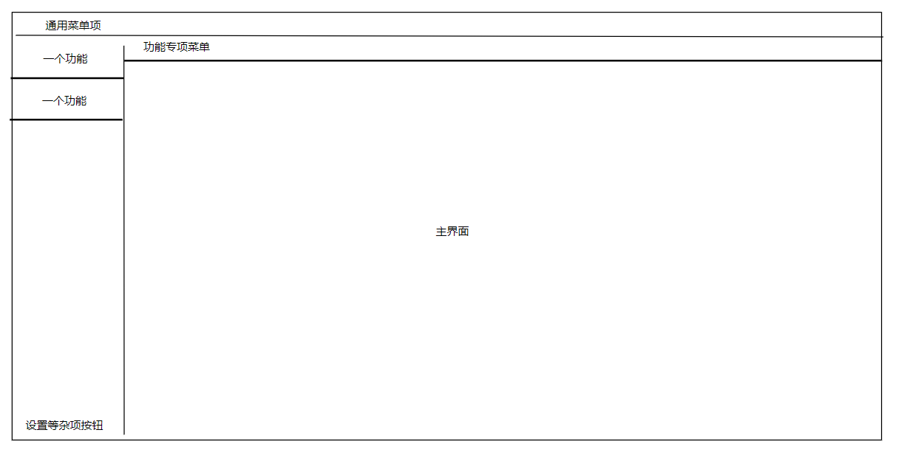

# 需求文档

## 前置内容

请搜索并了解一下关键词：MAD，一种对动画作品的二创，通常是二次剪辑及进行后期加工，需要剪辑和后期的能力。

请广泛了解各种视频风格，尤其可以在bilibili搜索优质MAD，例如风华回战，各种静止系MAD，播放量高的剪辑向MAD（排除标题党和封面党），误解系MAD等。并尽可能了解各个类型的MAD制作难点。

## 设计目标

我需要设计一款用于辅助MAD制作的工具，用于减少用户在人力上的机械消耗，从而将更多精力用于艺术创作上。

工具总布局如下

## 具体功能

以下每一项具体功能对应上述布局图片左侧的“一个功能”，并在点击后主界面显示该功能的界面。

### 自动抠图 / 抠像

在MAD制作，尤其是误解系MAD制作中，通常需要将一段动画片段中的人物十分精准地逐帧扣下来，虽然随着技术发展，使用PS工具抠一张图片已经比较轻松了，但是对一段视频的数十帧数百帧图片抠像依然十分费力。因此我需要寻找一种基于专用AI的方法，在给定视频片段+（任一：语言描述、首帧抠好的图片、人物描述或图片)得到一段抠好的视频。

最终的形式可以支持多种，包括图片序列、psd序列（原视频每帧+钢笔路径蒙版）、抠好的视频文件、当前打开AE中新增一个视频图层内有钢笔路径蒙版。以及多种你认为有必要的输出选项。如果你认为支持某种输出所增加的工程量过多，可以标注为暂时不做。

涉及到其他软件的，可使用其MCP完成。

### 关键词查找对应片段

在MAD制作中，我们通常要从原始大量动画素材中寻找想要的画面或片段，这无疑增加了许多人力成本。我希望提供一个功能，在提供完整的动画素材之后，使用AI对其进行分析，之后用户输入关键词，使用AI能力对视频素材进行匹配，并给出最符合关键词的若干片段。例如：用户输入“丰川祥子” “电车” ，界面显示若干“第11集.mp4 11:35 - 12:10 (对应视频预览)“ “第4集.mp4 6:46 - 6:53 (对应视频预览)“。

输入（可支持多次查询）：若干mp4视频文件。

输出：界面显示若干视频片段以及对应的文件和时间。这里不需要输出的每个片段首尾都非常精准，因为用户可以自己调整，但是大致位置是要对的。

需要可以对输入进行分组，每一组代表一个动画，每次查询在一个分组内查询。

关键词可以是场景、任务、台词、情节等。

可以让用户上传外挂字幕，如果没有的话，可以调研使用其他模型来根据音频得到字幕，通常为日语，但最好能支持多种语言。

## 设计准则

为了方便多个对话共享开发进度，同时为了减少上下文压缩带来的负面影响，我需要你再开始前首先调研技术方案，评估各个模块的可行性，然后自己写一份技术文档，记录哪个步骤应该使用什么技术或开源库来完成。然后完成一份设计文档，记录每个模块的技术细节和边界。之后使用json的格式存储一张有向无环图（DAG），每个节点标有一个子任务，例如调研并MCP，或者是开发某一个具体的模块。每开发完一个模块之后，修改此json内的字段，将它标记为已完成。在开发时必须按照一种拓扑序来安排开发任务，即不允许进行前置节点未完成的任务。

一定要先出方案，确定任务边界和技术架构，再执行！技术调研和设计方案是非常重要的，一定要认真执行！

为了防止在重复问题上浪费算力，我需要你在执行任务的时候，将遇到的可重复性问题记录在skill里，可在项目内新建合理的文件夹防止若干skill。

本文档仅为产品构想，不足以指导技术开发，你需要在技术调研的时候充分发挥你的主观能动性，并确立一个可行的技术方案，每个模块怎么实现，需要依赖什么外部的工具或模型。

不要实现超出文档设计边界的内容。关于文档没有提到的具体细节，例如文件夹名称，命名方式等，你可以自己决定。

设计的工具一定要充分检查各种输入，把用户当成傻子，任何不合法的输入都要明确提醒，并且不让用户进行下一步操作，防止用户无法理解工具使用方法。

## 开发平台

WPF为工具开发平台。同时配合使用PS AE等创作类软件。

## 其他

可以广泛充分使用其他开源代码库或模型。尤其是上述任务需要很多视觉模型或语言模型，语言模型可以考虑使用OpenAI的API，我的账号有额度，如果要使用请留空sk-key。
